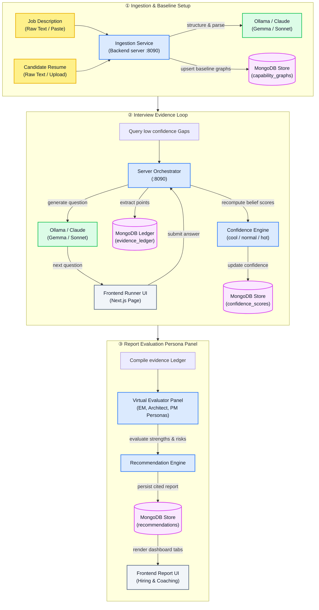

# rejected.ai

Local-first, AI-native **interview intelligence** platform. It evaluates engineering candidates through conversation, multi-lens evaluation personas, and **accumulating evidence** rather than simple keyword matching.

## Overview

rejected.ai automates the technical assessment process by translating raw job descriptions and resumes into rich capability graphs. It runs an adaptive interview evidence loop, prompting candidates and collecting structured evidence. After every answer, the platform recomputes candidate competency scores over the full evidence ledger. Finally, a panel of virtual evaluator personas generates a fully cited hiring recommendation report.

## How It Works

The system manages the candidate assessment journey through three primary architectural phases:



### Detailed Data Flow

#### Phase 1: Ingestion & Baseline Graph Setup
* **Document Parsing:** The frontend accepts a raw text paste or file upload for both the Job Description (JD) and Resume. The Go backend (`internal/documents`) parses the unstructured text via the configured LLM (local Ollama Gemma or Claude) to construct structured JSON definitions.
* **Graph Alignment:** The parsed capability lists are compared to compute baseline capability alignment graphs. Gaps, overlaps, and unknown skills are mapped and persisted in MongoDB (`capability_graphs`), which is used to initialize the interview round.

#### Phase 2: The Interview & Evidence Loop
* **Upfront Question Generation:** When the interview starts, the orchestrator queries `capability_graphs` for target expectations where evidence is low or zero, and generates the full set of questions in a single batch (sized to the chosen duration), persisted to `questions` / `turns`.
* **Answer Capture:** For each question the candidate submits an answer — typed, or recorded (audio transcribed via whisper.cpp when configured; otherwise a placeholder is stored). Each answer is recorded against its turn.
* **Deferred Batch Evaluation:** Evaluation is deferred until the report is generated. At that point, for each answered turn, the orchestrator runs evidence extraction (`internal/evidence` — positive/negative evidence, concepts, and supporting quotes written to `evidence_ledger`), response analysis, and confidence rescoring (`internal/confidence`), updating the belief metrics (`cool`, `normal`, `hot`) per competency in `confidence_scores`.
* **Retroactive Score Adjustment:** Because rescoring runs over the entire ledger at once, later answers can clarify, elaborate, or correct concepts from earlier turns — the belief analyzer revises those earlier scores accordingly.

#### Phase 3: Final Report & Panel Evaluation
* **Evaluator Personas Analysis:** When the interview concludes, the orchestrator compiles the full transaction history. It calls the virtual evaluator personas panel (`internal/evaluators`) to run independent assessments from the viewpoints of a **System Architect**, an **Engineering Manager**, and a **Product Manager**.
* **Signals & Risks Synthesis:** The signals service (`internal/signals`) identifies strongest positive signal highlights, while the risk engine (`internal/risk`) checks for architectural contradictions (e.g. inconsistent database choices between questions) or severe skill gaps.
* **Recommendation Persistence:** The recommendation engine combines the persona reports, risks, and signals to produce a final hiring recommendation (*Strong Hire*, *Hire*, *Hire with Risks*, *Borderline*, or *No Hire*) with an overall confidence score dial.
* **Coaching Generation:** Lastly, a personalized coaching guide is compiled detailing growth action plans, study paths, and seniority gap comparisons (Mentioned vs. Observed seniority badges).

## Capabilities / Tools

The platform consists of several orchestrating services and LLM agents:

| Tool / Core Function | Package / Path | Description | Touches / Modifies |
|---|---|---|---|
| **JD Ingestion** | `internal/documents` | Extracts competencies, technical expectations, and responsibilities from JDs. | MongoDB (`job_descriptions`) |
| **Resume Ingestion** | `internal/documents` | Identifies name, technologies, and experience levels from resumes. | MongoDB (`candidate_profiles`) |
| **Graph Generation** | `internal/capability` | Generates comparative charts matching profile to JD expectations. | MongoDB (`capability_graphs`) |
| **Question Generation** | `internal/interview` | Generates the full question set upfront from validation targets and low-confidence competencies. | MongoDB (`questions` / `turns`) |
| **Evidence Extraction** | `internal/evidence` | Extracts positive/negative evidence, concepts, and quotes from answers. | MongoDB (`evidence_ledger`) |
| **Confidence Recompute** | `internal/confidence` | Recomputes belief scores ensuring logical constraints (`cool >= normal >= hot`). | MongoDB (`confidence_scores`) |
| **Evaluator Personas** | `internal/evaluators` | Generates assessments from virtual EM, Architect, and PM personas. | MongoDB (`recommendations`) |
| **Strongest Signals** | `internal/signals` | Pinpoints positive candidate highlights from the evidence ledger. | MongoDB (`recommendations`) |
| **Risk Assessment** | `internal/risk` | Identifies architectural contradictions, gaps, and missing requirements. | MongoDB (`recommendations`) |
| **Hiring Decision** | `internal/recommendation` | Renders a final hire decision (*Strong Hire* to *No Hire*) with citations. | MongoDB (`recommendations`) |

## Tech Stack

* **Frontend:** React / Next.js (TypeScript, App Router, Vanilla CSS, SVG circular dials)
* **Backend:** Go 1.26 (Standard library HTTP multiplexer, MongoDB driver)
* **LLM Provider:** Ollama (default local backend) or Anthropic (opt-in API key)
* **Models:**
  * **Ollama (Local):** `gemma4:e4b` (generation)
  * **Anthropic:** `claude-sonnet-4-6` (generation)
* **Database:** MongoDB (document database)

## Prerequisites

* **Go 1.26+**
* **Node 20+**
* **MongoDB** (`mongod`) running on port `27017`
* **Ollama** running locally on port `11434`
  * Fetch the generation model:
    ```bash
    ollama pull gemma4:e4b
    ```

## Ports & Services

| Port | Service | Description |
|---|---|---|
| `8090` | Go Backend Server | REST API orchestration, database queries, and LLM calls. |
| `3000` | Next.js Frontend UI | Dashboard application for running interviews and viewing reports. |
| `27017` | MongoDB | Primary document database. |
| `11434` | Ollama | Local LLM inference server. |

## Configuration

Config values are loaded from `config.json` in the backend root directory. Exclude comments and maintain valid JSON.

| Key | Description | Default Value | Required? |
|---|---|---|---|
| `SERVER_ADDR` | Bind address for Go server | `":8090"` | No |
| `MONGO_URI` | MongoDB Connection URI | `"mongodb://localhost:27017"` | No |
| `MONGO_DB` | MongoDB Database name | `"rejected_ai"` | No |
| `LLM_BACKEND` | LLM generation backend (`"ollama"` or `"anthropic"`) | `"ollama"` | No |
| `OLLAMA_HOST` | Local Ollama endpoint | `"http://localhost:11434"` | No |
| `OLLAMA_MODEL` | Ollama model for generation | `"gemma4:e4b"` | No |
| `OLLAMA_NUM_CTX` | Token context size limit | `16384` | No |
| `ANTHROPIC_API_KEY` | Anthropic API key | `""` | Yes (if backend is `anthropic`) |
| `ANTHROPIC_MODEL` | Anthropic model for generation | `"claude-sonnet-4-6"` | No |
| `MAX_TOKENS` | Max generation tokens | `4096` | No |
| `TEMPERATURE` | LLM generation temperature | `0.4` | No |
| `WHISPER_BIN` | Path to `whisper.cpp` CLI binary | `""` | No (fallback to manual transcript) |
| `WHISPER_MODEL` | Path to Whisper model file | `""` | No |
| `VIDEO_DETECTOR_BIN`| Path to external video metrics CLI | `""` | No (fallback to metadata upload) |

## Quick Start (automated)

From the repo root, run the setup script — it checks/installs everything the project
needs (Go, Node, MongoDB, Ollama + the model, Go modules, frontend npm deps), shows an
**estimated download size and asks for confirmation first**, streams live progress
(percentages + download speed) for the heavy steps, and is safe to re-run:

```bash
./setup.sh          # or: bash setup.sh
```

> Note the filename is `setup.sh` (run `./setup.sh`, not `./setup`). The scripts are
> committed executable, so `./setup.sh` works; `bash setup.sh` works too.

On a clean machine it downloads **~11–12 GB total** (mostly the one-time ~9.6 GB Ollama
model); already-installed pieces are skipped, so repeat runs are far smaller. It does
**not** start anything — when it finishes it **prints the two commands to start the app**.
Use `./setup.sh -y` to skip the confirmation prompt.

### Teardown

To undo it later:

```bash
./teardown.sh        # or: bash teardown.sh
```

It shows a red warning that **this permanently deletes your saved interview records**,
requires you to type `yes`, then drops the project database, removes the pulled model,
deletes app artifacts, and stops the services. Add `--purge` to also uninstall the
MongoDB & Ollama apps (and back up + remove `config.json`). It leaves shared tools
(Go, Node, Homebrew) untouched.

> Prefer to do it by hand? The manual, step-by-step setup is below.

## Installation

### Backend Setup
1. Clone the repository and navigate to the directory:
   ```bash
   cd rejected.ai
   ```
2. Copy configuration example:
   ```bash
   cp config.example.json config.json
   ```

### Frontend Setup
1. Navigate to the web folder and install dependencies:
   ```bash
   cd web
   ```
2. Install Node packages:
   ```bash
   npm install
   ```

## Running Locally

### 1. Start the Go Backend
Ensure MongoDB and Ollama are running, then execute:
```bash
go build -o bin/server ./cmd/server
./bin/server
```
The server will bind to port `8090`. Verify health:
```bash
curl -s http://localhost:8090/healthz
# {"llm_backend":"ollama","llm_model":"gemma4:e4b","mongo":"ok","status":"ok"}
```

### 2. Start the Frontend UI
In a separate terminal:
```bash
cd web
npm run dev
```
Open **[http://localhost:3000](http://localhost:3000)** in your browser.

*Note: The first run will prompt you to paste a Job Description and Candidate Resume. You can load sample data using the "Load Sample" button on the home screen.*

## Core API Route Registry

| Route | Method | Description |
|---|---|---|
| `/healthz` | `GET` | Health check (reports MongoDB status and LLM provider config). |
| `/api/job-descriptions` | `POST` | Ingests raw job description text to create structured targets. |
| `/api/resumes` | `POST` | Ingests candidate resume text to create structured profile capabilities. |
| `/api/interviews` | `POST` | Initializes an interview session (builds capability graphs and gets Q1). |
| `/api/interviews` | `GET` | Lists all past interview rounds. |
| `/api/interviews/{id}` | `GET` | Retrieves full interview details (questions, turns, transcripts, evidence). |
| `/api/interviews/{id}` | `DELETE` | Cascades delete for an interview and all related database records. |
| `/api/interviews/{id}/answer` | `POST` | Submits candidate's answer for the current question and returns the next turn. |
| `/api/interviews/{id}/report` | `POST` | Kicks off asynchronous report generation (LLM assessment steps). |
| `/api/interviews/{id}/report` | `GET` | Retrieves report generation progress status or the final completed report. |
| `/api/interviews/{id}/transcript` | `POST` | Ingests manual audio transcripts for speech statistics. |
| `/api/interviews/{id}/audio` | `POST` | Ingests audio files; transcribes via whisper.cpp when configured, otherwise stores a placeholder transcript (use the transcript endpoint for real text). |
| `/api/interviews/{id}/video-metadata` | `POST` | Ingests frame statistics for gaze/attention presence tracking. |
| `/api/interviews/{id}/video` | `POST` | Ingests video files for frame presence and gaze analytics. |
| `/api/candidates/{id}/trends` | `GET` / `POST` | Retrieves or calculates candidate competency growth trends across interviews. |

## Usage Example

1. **Ingest Job Description and Resume:** Pasting aPayments Engineer JD and candidate resume creates the profile.
2. **Start Interview:** Click "Start interview". The system generates Question 1: *"Explain how you design a payments ingestion pipeline for idempotency."*
3. **Submit Answer:** Candidate submits answer: *"I use PostgreSQL unique keys to prevent duplicate transactions."*
4. **Evidence Analysis:** The background LLM extracts evidence:
   - *Positive:* Validated Distributed Systems knowledge (uses unique keys).
   - *Next Question:* System generates Question 2 on message safety and queues.
5. **Get Report:** The completed round outputs a hiring recommendation (e.g. *Hire with Risks*, citing the specific turns and evaluating competencies).

## Project Structure

```
rejected.ai/
├── cmd/                          # Entry points
│   ├── check_db/                 # Database validation script
│   ├── insert_dummy/             # Mock data insertion tool
│   └── server/                   # Main Go web server
├── internal/                     # Domain modules (Go)
│   ├── api/                      # REST endpoints & middleware
│   ├── assumptions/              # Candidate assumptions processor
│   ├── capability/               # Capability graph builders
│   ├── confidence/               # Competency rescoring logic
│   ├── config/                   # Config loader & validations
│   ├── documents/                # JD & Resume parser services
│   ├── evaluators/               # Persona-based panel reviews
│   ├── evidence/                 # Evidence ledger analyzer
│   ├── interview/                # Session and turn managers
│   ├── learning/                 # Cross-interview trend tracking
│   ├── llm/                      # Ollama & Anthropic client interfaces
│   ├── media/                    # Audio/Video metadata metrics
│   ├── recommendation/           # Final recommendation engine
│   ├── risk/                     # Gaps and risk analyzers
│   ├── signals/                  # Key technical highlights
│   └── store/                    # Database client store
├── notes/                        # Specification and format docs
├── scripts/                      # Testing & local run scripts
├── web/                          # Next.js UI Frontend
│   ├── app/                      # App router layout & pages
│   ├── components/               # Gauges, bars, and dials
│   └── lib/                      # API client interface typescript types
├── README.md                     # Platform documentation
├── config.example.json           # Template configuration file
└── go.mod                        # Go module specifications
```

## Testing / Evaluation

Run the complete backend test suite:
```bash
go test ./...
```
To run an end-to-end simulated CLI pipeline that generates mock data, evaluates turns, and prints retroactive evidence rescoring:
```bash
./scripts/seed_demo.sh
```

## Cost & Rate Limits

* **Ollama Backend (Local):** 100% free and runs entirely locally. There are no API costs or rate limits.
* **Anthropic Backend:** Standard token-based rates apply for calls to `claude-sonnet-4-6`. Ensure your usage complies with Anthropic's tier-based rate limits.
