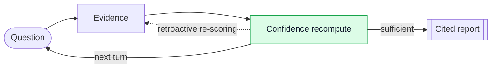
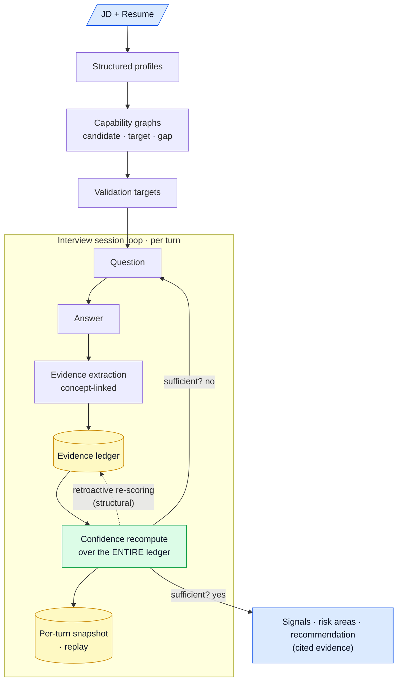

# rejected.ai — Architecture

Local-first, AI-native interview intelligence platform. Evaluates engineering
candidates through conversation and **accumulating evidence** rather than keyword
matching. The defining behavior is the evidence loop:



Scores are never frozen — a later answer that reveals deeper understanding lifts the
confidence attributed to earlier shorthand answers, and every score is explainable via
the evidence ledger.

## Stack

| Concern | Choice |
|---|---|
| Backend | Go 1.26, stdlib `net/http` `ServeMux` (method+path patterns), no web framework |
| LLM generation/streaming | Pluggable `llm.Caller` / `llm.Streamer`; **Ollama `gemma4:e4b` default**, Anthropic via `LLM_BACKEND=anthropic` |
| Embeddings | `llm.Embedder`; Ollama `nomic-embed-text` (`/api/embed`) — always local |
| Database | MongoDB (local `mongod`), `go.mongodb.org/mongo-driver/v2` |
| Config | `config.json` (template: `config.example.json`) |
| Frontend | ✅ Next.js (App Router) in `web/` — setup, live runner, report/replay; consumes the Go REST API (CORS open) |

## Package layout (`internal/`)

| Package | Responsibility | Status |
|---|---|---|
| `config` | Load/validate `config.json`, apply defaults | ✅ Phase 0 |
| `llm` | `Caller`/`Streamer`/`Embedder` interfaces, Ollama + Anthropic impls, `CallJSON` helper, `New()` factory | ✅ Phase 0 |
| `store` | Mongo v2 client, collection constants, `EnsureIndexes` | ✅ Phase 0 |
| `api` | `ServeMux` router, logging middleware, `/healthz` | ✅ Phase 0 |
| `documents` | JD/resume upload + PDF/DOCX/TXT extraction + LLM structuring | ✅ Phase 1 |
| `capability` | Candidate / target / gap graphs (LLM JSON) | ✅ Phase 2 |
| `interview` | Session orchestration, dynamic question generation, memory | ✅ Phase 3 |
| `evidence` | Evidence extraction (concept-linked) → evidence ledger | ✅ Phase 4 |
| `confidence` | Confidence recompute over full ledger + retroactive re-scoring (CORE) | ✅ Phase 4 |
| `signals` | Compression ratio (measurable) + strongest signals | ✅ Phase 4/7 |
| `concept` | Concept clusters folded into evidence extraction for now | ➡️ in evidence |
| `assumptions` | Per-answer assumptions + clarification-vs-deflection | ✅ Phase 5 |
| `evaluators` | Persona panel (Architect/EM/Staff+/Operator/ATS/Comms/AI-Native) | ✅ Phase 6 |
| `risk` | Missing / weak / JD-risk categorization | ✅ Phase 7 |
| `recommendation` | Hire decision + reasoning + evidence citations | ✅ Phase 7 |
| `report` | Orchestrates final scores + personas + signals + risk + recommendation | ✅ Phase 7 |
| `media` | Audio: measurable signals (WPM, fillers, latency) + pluggable whisper.cpp. Video: measurable signals (engagement/attention/participation/timing) + pluggable detector | ✅ Phase 9 (audio), ✅ Phase 10 (video) |
| `learning` | Cross-interview competency trends per candidate (deterministic, no LLM): trajectory + direction + pattern summary | ✅ Phase 11 |

## Data flow (target, Phases 1–7)



## MongoDB collections

`job_descriptions`, `candidate_profiles`, `interviews`, `questions`, `answers`,
`transcripts`, `video_metadata`, `capability_graphs`, `confidence_scores` (per-turn
snapshots), `competency_scores` (confidence + cool/normal/hot + evidence refs),
`evidence_ledger`, `signals`, `risk_areas`, `recommendations`, `historical_trends`.

Indexes are created by `store.EnsureIndexes`; the dominant access pattern is
"everything for one `interview_id`".

## Running locally

```bash
# Prereqs: mongod running on :27017, ollama serving gemma4:e4b + nomic-embed-text
cp config.example.json config.json   # already present
go build -o bin/server ./cmd/server
./bin/server
curl -s localhost:8090/healthz
# -> {"llm_backend":"ollama","llm_model":"gemma4:e4b","mongo":"ok","status":"ok"}
```

Config keys: see `config.example.json`. Switch to Anthropic with
`"LLM_BACKEND": "anthropic"` + `"ANTHROPIC_API_KEY"`.
